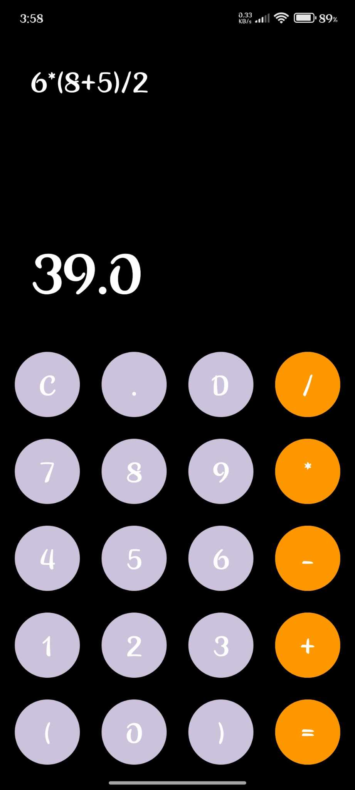

# Android Calculator App

A simple calculator app built using Java for Android. This application provides basic arithmetic operations such as addition, subtraction, multiplication, and division.

## Features
- Basic arithmetic operations: Addition, Subtraction, Multiplication, and Division.
- User-friendly interface.
- Real-time result updates.
- Error handling for invalid inputs.

## **Screenshots 📸**

  
_ICON._

  
_UI._


## Technologies Used
- Java
- Android Studio
- XML (for UI design)


## Installation
1. Clone the repository:
   ```bash
   git clone https://github.com/hasan-mehedii/Android_Project_Calculator.git
2. Open the project in Android Studio.
3. Build and run the app on an emulator or a physical device.


## Usage
1. Enter the numbers in the input fields.
2. Choose the desired arithmetic operation.
3. Press the = button to get the result.
4. Use the C button to clear the input.


## Future Enhancements
1. Implement advanced mathematical functions like square root, percentage, etc.
2. Improve UI/UX design.
3. Add history tracking for calculations.
4. Support for dark mode.


## Contact
For any inquiries or suggestions, please reach out to me via:
- Email: [mehedi-2022415897@cs.du.ac.bd](mailto:mehedi-2022415897@cs.du.ac.bd)
- GitHub: [hasan-mehedii](https://github.com/hasan-mehedii)
